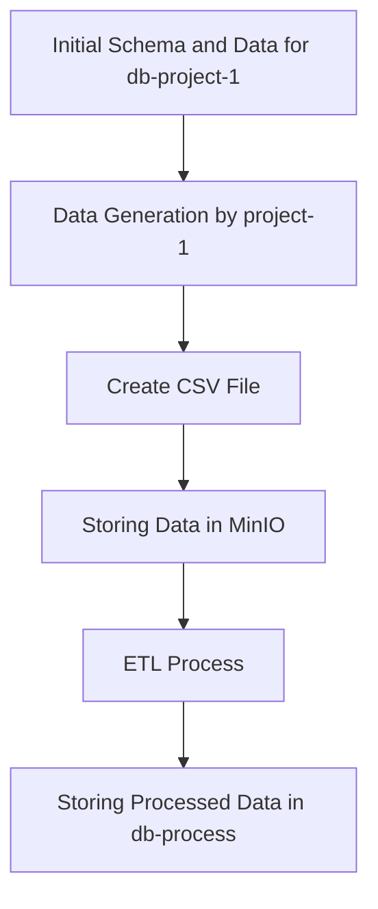

# Data Engineering Project Documentation

## Overview

This document provides an overview of the data engineering project consisting of five services. Each service plays a crucial role in generating, processing, and storing data.

## Services

### 1. db-project-1

- **Type**: PostgreSQL Database
- **Description**: This database is dedicated to project-1, serving as the primary data store for transaction information.

### 2. project-1

- **Type**: Python Service
- **Description**: This service generates mockup transaction data simulating income from AWS usage transactions. It exports the generated data to CSV format and stores it in MinIO.

### 3. minio

- **Type**: File Storage
- **Description**: MinIO serves as the file storage solution for storing the generated CSV.gz files from the project-1 service.

### 4. db-process

- **Type**: PostgreSQL Database
- **Description**: This database is used for processing data, supporting the ETL operations of the project.

### 5. process

- **Type**: ETL Service
- **Description**: This service is responsible for Extracting, Transforming, and Loading (ETL) data to ensure it is ready for analysis and reporting.

## Workflow Diagram

The following diagram illustrates the workflow of the data engineering project:



### Workflow Steps

- **1**: Represents the initial step where the database schema and data for `db-project-1` are set up.
- **2**: Indicates the data generation phase by the `project-1` service.
- **3**: Shows the creation of the CSV file from the generated data.
- **4**: Represents the storage of the CSV file in MinIO.
- **5**: Indicates the ETL process where the data is extracted, transformed, and loaded.
- **6**: Final step where the processed data is stored in `db-process`.

## Installation and Setup

### Prerequisites

Ensure you have Docker and Docker Compose installed on your machine.

### Installation Instructions

#### For Windows

1. **Install Docker Desktop**:
   - Download and install [Docker Desktop for Windows](https://www.docker.com/products/docker-desktop).
   - Follow the installation instructions on the website.
2. **Verify Installation**:
   - Open a command prompt and run:
     ```bash
     docker --version
     docker-compose --version
     ```

#### For Mac

1. **Install Homebrew** (if not already installed):

   - Open a terminal and run:
     ```bash
     /bin/bash -c "$(curl -fsSL https://raw.githubusercontent.com/Homebrew/install/HEAD/install.sh)"
     ```

2. **Install Docker**:

   - Run the following command to install Docker using Homebrew:
     ```bash
     brew install --cask docker
     ```

3. **Start Docker Desktop**:

   - Open Docker Desktop from your Applications folder.

4. **Verify Installation**:
   - In the terminal, run:
     ```bash
     docker --version
     ```

#### For Linux

1. **Install Docker**:
   - Follow the official Docker installation guide for your Linux distribution from [Docker's website](https://docs.docker.com/engine/install/).
2. **Install Docker Compose**:

   - You can install Docker Compose by running:
     ```bash
     sudo curl -L "https://github.com/docker/compose/releases/latest/download/docker-compose-$(uname -s)-$(uname -m)" -o /usr/local/bin/docker-compose
     sudo chmod +x /usr/local/bin/docker-compose
     ```

3. **Verify Installation**:
   - Open a terminal and run:
     ```bash
     docker --version
     ```

## Running the Project

1. Clone the project repository or create a directory for your project.
2. Navigate to the project directory.
3. Create a `docker-compose.yaml` file with the necessary configurations for your services.
4. Run the following command to start all services:

   ```bash
   docker compose up -d
   ```

5. To stop the services, run:
   ```bash
   docker compose down
   ```

## Conclusion

This project architecture supports efficient data generation, storage, and processing, enabling effective data management and analysis for project-1. Follow the installation instructions to set up your environment using Docker Compose.
"""
